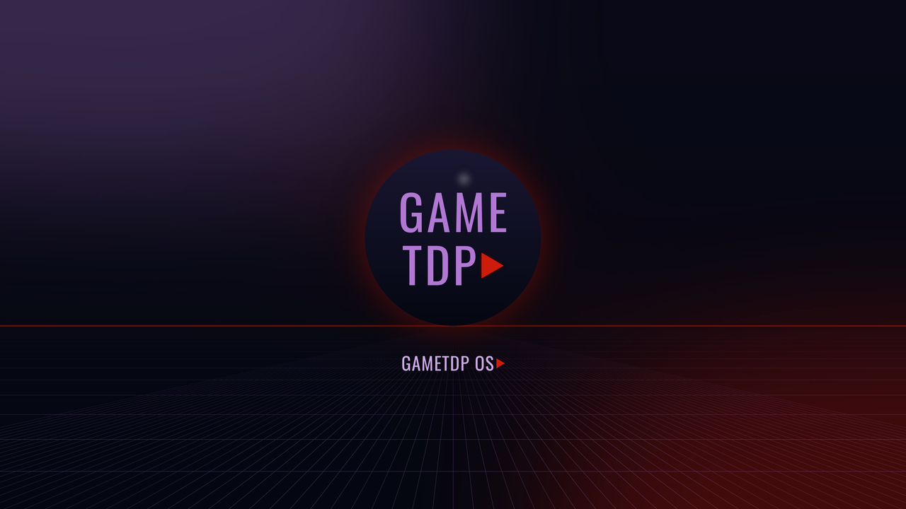

# GameTDP OS

A gaming-first Linux desktop for AMD PCs. Install it next to Windows, play your Windows games
through Steam's Proton, Heroic, Lutris and Bottles, and let it keep itself up to date.

GameTDP OS is built on [Bazzite](https://bazzite.gg) (Fedora Atomic + KDE Plasma), which already
ships the parts that make Linux gaming work well on AMD: the latest Mesa (RADV) graphics drivers,
a gaming-tuned kernel, Steam with Proton, Lutris, Gamescope, MangoHud and HDR support. On top of
that GameTDP OS adds:

- **More ways to install Windows games**: Heroic (Epic Games, GOG, Amazon) and Bottles (any
  Windows `.exe` or installer) are installed and pinned to the taskbar, next to Steam and Lutris.
- **Everyday apps on first boot**: Firefox, image viewer, PDF reader, video player, ProtonPlus
  (extra Proton versions), Protontricks and more.
- **GameTDP look**: TDPlay-style logo on the start button, boot screen, About page and terminal,
  and a GameTDP wallpaper on the desktop, lock screen and login screen.
- **Safe automatic updates**: a new version is built every day from the latest Bazzite. Your PC
  only accepts versions signed by this repository, installs them in the background and switches
  over on the next restart. If an update misbehaves, pick the previous version at boot.

Made for a Ryzen 7 3800X + Radeon RX 7900 XTX gaming PC, and works on any PC with an AMD or Intel
graphics card.

## Will my games work?

Most Windows games do. Check a game before you rely on it:

- [ProtonDB](https://www.protondb.com): community reports for Steam games.
- [Are We Anti-Cheat Yet?](https://areweanticheatyet.com): games whose anti-cheat blocks Linux,
  such as Valorant, Fortnite, League of Legends and several Call of Duty titles. Keep Windows for
  those; GameTDP OS installs on its own drive and leaves Windows alone.

## What you need

- A **separate SSD** for GameTDP OS. 1–2 TB NVMe is ideal since you'll download games again on it.
- A **USB stick of 16 GB or more**. It will be erased.
- About an hour.

> [!WARNING]
> Installing erases the drive you select. Only ever select the **new** SSD in the installer.
> Your Windows drive and your other drives stay untouched as long as you don't select them.

## Install

### 1. Fit the new SSD

Install the SSD in the PC, start Windows once and check it shows up in *Disk Management* (you
don't need to format it). Note its size, so you can recognise it in the installer.

### 2. Download the installer

1. Open the [Actions tab](https://github.com/mircix/gametdp-os/actions/workflows/build-disk.yml) of this repository (sign in to GitHub).
2. Click the newest successful (green) **Build GameTDP OS installer (ISO)** run.
3. Under **Artifacts**, download **GameTDP-OS-installer** and unzip it. Inside is
   `GameTDP-OS-<date>.iso`.

No successful run yet, or older than 90 days? Click **Run workflow** on that page and wait
about 30 minutes.

### 3. Write it to the USB stick

On Windows, use [Fedora Media Writer](https://fedoraproject.org/workstation/download)
(choose *Select .iso file*) or [balenaEtcher](https://etcher.balena.io). Pick the ISO, pick the
USB stick, write.

### 4. Turn Secure Boot off (for now) and start the installer

With Secure Boot on, many 2026 firmware versions stop the installer with *bad shim signature*
(the same happens with Bazzite). Turn it off for the install; step 6 turns it back on.

1. Restart and press **Del** (or F2) to open the BIOS. On ASUS boards: **F7** (Advanced Mode) →
   **Boot** → **Secure Boot** → **OS Type** → **Other OS**. Press **F10** to save and restart.
   Don't start Windows while Secure Boot is off: if BitLocker is on, it would ask for its
   recovery key (you'd find it at https://aka.ms/myrecoverykey).
2. Plug in the USB stick and restart.
3. Tap the boot menu key while the PC starts: **F8** on most ASUS boards, **F11** on MSI and
   ASRock, **F12** on Gigabyte.
4. Choose the entry that starts with **UEFI:** and names your USB stick.
5. In the black menu that appears, choose **Install GameTDP OS 44** (if the screen stays black
   after that, restart and pick *Install GameTDP OS 44 in basic graphics mode*).

### 5. In the installer

1. **Installation Destination**: untick every disk except the new SSD. Choose *Automatic*.
   If it says there's not enough free space, choose *Reclaim space* → *Delete all*, which only
   affects the disk you ticked.
2. **User Creation**: create your account and tick *Make this user administrator*.
3. Set the time zone, then **Begin Installation**. When it finishes, click **Reboot** and pull
   out the USB stick.

### 6. Turn Secure Boot back on

If a blue **Perform MOK management** screen appears on the first restart, choose
**Continue boot** for now. Then, once GameTDP OS has started:

1. Open **Konsole** and run `ujust enroll-secure-boot-key` (type your own password if asked).
2. Restart into the BIOS and switch Secure Boot back on (ASUS: **OS Type** → **Windows UEFI
   mode**), then **F10**.
3. A blue **Perform MOK management** screen appears (it needs a keyboard): **Enroll MOK** →
   **Continue** → **Yes**, type the password **`universalblue`** (nothing shows while you type),
   Enter, **Reboot**.

This lets Secure Boot trust GameTDP OS's kernel (the same key Bazzite uses), so both Windows and
GameTDP OS start with Secure Boot on. Some Windows games' anti-cheat needs it on. A later BIOS
update can switch this off again; if *bad shim signature* comes back, repeat this step.

### 7. First login

Log in. Steam and Lutris are ready straight away. The other apps (Firefox, Heroic, Bottles...)
download in the background during the first 10–20 minutes, and their taskbar icons appear as
they finish. They need an internet connection; if you set up Wi-Fi after logging in they start
then.

## Everyday use

**Choosing Windows or GameTDP OS.** Use the boot menu key from step 4, or set your preferred
default in the BIOS boot order. To jump to Windows from Steam, open a terminal (Konsole) once and
run `ujust setup-boot-windows-steam`, which adds a "Boot Windows" tile to your Steam library.

**Installing Windows games:**

| Store or game | Use |
| --- | --- |
| Steam | Steam. In *Settings → Compatibility*, turn on *Enable Steam Play for all other titles* for non-verified games |
| Epic Games, GOG, Amazon Prime Gaming | Heroic |
| Battle.net, EA app, Ubisoft Connect, Rockstar and others | Lutris (search the game or launcher and click *Install*) |
| Any other Windows game or program (`setup.exe`) | Bottles: create a *Gaming* bottle and run the installer in it |

**Your Windows drives** appear in the file manager, so you can copy files from them. Don't run or
install games *from* a Windows (NTFS) drive; install them on the GameTDP OS drive.

**Updates** happen on their own and apply when you restart. To roll back, choose the previous
entry in the boot menu that appears at startup, or run `sudo bootc rollback` and restart.

**Useful commands** (type them in Konsole):

| Command | What it does |
| --- | --- |
| `ujust` | Menu of every helper command |
| `ujust gametdp-apps` | Install any GameTDP apps that are missing |
| `ujust gametdp-apps-reset` | Reinstall the whole app set, including apps you removed |
| `ujust install-coolercontrol` | Fan and cooling control app |
| `ujust enroll-secure-boot-key` | Redo the Secure Boot key step if you skipped the blue screen |

Show the FPS counter in a Steam game: right-click the game → *Properties* → *Launch Options*:
`mangohud %command%`.

## Keeping the daily builds running

GitHub pauses scheduled builds in a repository that has had no activity for 60 days, and emails
you when it does. Your PC keeps working, it just stops receiving updates. To restart them, open
[Actions → Build GameTDP OS image](https://github.com/mircix/gametdp-os/actions/workflows/build.yml) and click **Enable workflow**.

---

## How it's built

| Path | What it is |
| --- | --- |
| `Containerfile` | Starts from `ghcr.io/ublue-os/bazzite:stable` and runs `build_files/build.sh` |
| `build_files/build.sh` | Branding, app installer service, update signing policy, initramfs rebuild |
| `system_files/` | Files copied into the OS as-is (artwork, app list, services, `ujust` recipes) |
| `branding/make_assets.py` | Renders the logo, wallpaper and boot-splash artwork into `system_files/` |
| `disk_config/iso.toml` | USB installer settings: update source and Secure Boot key enrollment |
| `tests/smoke.sh` | Checks run inside every new image before it's published |
| `.github/workflows/build.yml` | Daily: build → smoke test → publish → sign |
| `.github/workflows/build-disk.yml` | On demand and monthly: build the installer ISO |

Images are signed with cosign. The public key is `cosign.pub`; the private key is the repository
secret `SIGNING_SECRET`. Installed systems verify updates against
`/etc/pki/containers/gametdp-os.pub`.

Already running Bazzite? Switch to GameTDP OS without reinstalling:
`sudo bootc switch --enforce-container-sigpolicy ghcr.io/mircix/gametdp-os:stable`, then restart.

Based on the Universal Blue [image-template](https://github.com/ublue-os/image-template) and
[Bazzite](https://github.com/ublue-os/bazzite), both Apache-2.0.
